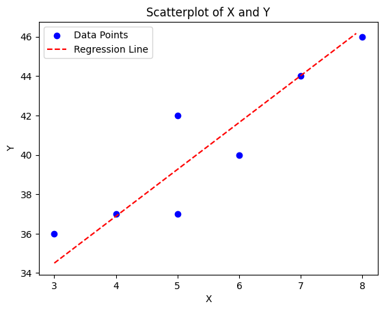

<head>
<title>Linear Regression</title>
<script>
MathJax = {
  tex: {
    inlineMath: [['$', '$'], ['\\(', '\\)']],
    displayMath: [['$$', '$$'], ['\\[', '\\]']]
  }
};
</script>
<script id="MathJax-script" async src="https://cdn.jsdelivr.net/npm/mathjax@3/es5/tex-mml-chtml.js"></script>
</head>

# Linear Regression
Reading
* James et al., 3.1 Simple Linear Regression

[Linear Regression Lecture Code](./code/16_LinearRegression.ipynb)

## Regression Models


We will start by looking at models that provide a numerical output. 
* We can compare predictions ($\hat{y}$) to the true value ($y$) by measuring the actual distance ($\hat{y}-y$), also known as a __residual__
* To measure the effectiveness of a regression model, we need metrics based on residuals, which means we use,
  * MAE, SSE, MSE, RMSE, RMSLE
  * Others (we'll see some)

There are many regression models. This semester, we'll only choose one. We'll focus on *linear regression*. You have likely seen linear regression in past statistics courses. We will delve into it a little more deeply from a data science perspective.

Also, note that this will not be the last time we see linear regression. In MATH 3280, we will expand our view of this model by looking at multi-linear regression, or linear regression with multiple input variables. Then in MATH 3480, we'll look at other variants such as polynomial regression, lasso regression, and ridge regression.

To start our discussion on linear regression, let's review the basics of variance, covariance, and correlation.

## Variance
Define two datasets,
$$X=\{x_0,x_1,x_2,\dots\}\qquad Y=\{y_0,y_1,y_2,\dots\}$$

The __mean__ of the two datasets are found as,
$$(\mu_x,\mu_y) = \left(\frac{1}{n}\sum_{i=1}^n x_i, \frac{1}{n}\sum_{i=1}^n y_i\right)$$

The __variance__ is the average squared distance from the mean.
$$var(X) = \frac{1}{n-1}\sum_{i=1}^n (x_i-\mu_x)^2 \qquad\qquad var(Y) = \frac{1}{n-1}\sum_{i=1}^n (y_i-\mu_y)^2$$

But the variance doesn't tell the whole story. Look at the variance of these two datasets:
| $X_1$ | $Y_1$ |     | $X_2$ | $Y_2$ |
| :---: | :---: | --- | :---: | :---: |
|  -2   |   1   |     |  -2   |  -1   |
|   0   |   1   |     |   0   |  -1   |
|   0   |  -1   |     |   0   |   1   |
|   2   |  -1   |     |   2   |   1   |

$$var(X_1) = 2 \qquad var(X_2) = 2$$
$$var(Y_1) = 1 \qquad var(Y_2) = 1$$

They have the same variance, but the behavior is very different. So, we need to look at the how the variances of the two variables relate with each other. 
* Note the extreme points. 
  * If the product of the extreme points is negative, that means we are in quandrants II and IV, so we have a negative relationship.
  * If the product of the extreme points is positive, that means we are in quandrants I and III, so we have a positive relationship.

## Covariance
The __covariance__ is then the average product of the different dimensions.
$$cov(X,Y) = \frac{1}{n-1}\sum_{i=1}^n (x_i-\mu_x)(y_i-\mu_y)$$

## Correlation
Finally, the __correlation__, which tells us the strength of the relationship between the two variables, is,
$$corr[A,B] = \frac{cov[X,Y]}{\sigma_x\sigma_y} = \frac{cov[X,Y]}{\sqrt{var[X]var[Y]}}= \frac{1}{n-1}\sum\left(\frac{x-\mu_x}{\sigma_x}\frac{y-\mu_y}{\sigma_y}\right)$$

#### Example
* Find the variance of A and of B, then find the covariance between them

    |   X   |   5   |   4   |   7   |   8   |   3   |   5   |   6   |
    | :---: | :---: | :---: | :---: | :---: | :---: | :---: | :---: |
    |   Y   |  42   |  37   |  44   |  46   |  36   |  37   |  40   |

$$\bar{X}=\frac{5+4+7+8+3+5+6}{7} = 5.4286 \qquad \bar{Y} = \frac{42+37+44+46+36+37+40}{7} = 40.2857$$

$$\begin{align*}var(X) &= \frac{1}{7-1}\left[(5-5.4286)^2 + (4-5.4286)^2 + (7-5.4286)^2 + (8-5.4286)^2 + (3-5.4286)^2 \right.\\
  &\qquad\qquad\left.+ (5-5.4286)^2 + (6-5.4286)^2\right] \\
  &= \frac{1}{6}\left[(-0.4286)^2+(-1.4286)^2+(1.5714)^2+(2.5714)^2+(-2.4286)^2+(-0.4286)^2+(0.5714)^2\right] \\
  &= \frac{1}{6}\left[0.1837+2.0408+2.4694+6.6122+5.8980+0.1837+0.3265\right]\\
  &= \frac{1}{6}(17.7143)\\
  &= 2.9524
  \end{align*}$$

$$\begin{align*}var(Y) &= \frac{1}{7-1}\left[(42-40.2857)^2 + (37-40.2857)^2 + (44-40.2857)^2 + (46-40.2857)^2 + (36-40.2857)^2 \right.\\
  &\qquad\qquad\left. + (37-40.2857)^2 + (40-40.2857)^2\right] \\
  &= \frac{1}{6}\left[(1.7143)^2 + (-3.2857)^2 + (3.7143)^2 + (5.7143)^2 + (-4.2857)^2 + (-3.2857)^2 + (-0.2857)^2\right] \\
  &= \frac{1}{6}\left[(2.9388) + (10.7959) + (13.7959) + (32.6531) + (18.3673) + (10.7959) + (0.0816)\right]\\
  &= \frac{1}{6}(89.4286) \\
  &= 14.9048
  \end{align*}$$

$$\begin{align*}cov(X,Y) &= \frac{1}{7-1}\left[(5-5.4286)(42-40.2857) + (4-5.4286)(37-40.2857) + (7-5.4286)(44-40.2857) \right.\\
  &\qquad\qquad\left. + (8-5.4286)(46-40.2857) + (3-5.4286)(36-40.2857) \right. \\
  &\qquad\qquad\left. + (5-5.4286)(37-40.2857) + (6-5.4286)(40-40.2857) \right] \\
  &= \frac{1}{6}\left[(-0.4286)(1.7143) + (-1.4286)(-3.2857) + (1.5714)(3.7143) + (2.5714)(5.7143) \right. \\
  &\qquad\left. + (-2.4286)(-4.2857) + (-0.4286)(-3.2857) + (0.5714)(-0.2857)\right] \\
  &= \frac{1}{6}\left[-0.7347+4.6939+5.8367+14.6939+10.4082+1.4082-0.1633\right] \\
  &= \frac{1}{6}(36.1429) \\
  &= 6.0238
  \end{align*}$$

$$corr(X,Y) = \frac{cov(X,Y)}{\sqrt{var(X)var(Y)}} = \frac{6.0238}{\sqrt{2.9524*14.9048}} = 0.9081$$

```python
import numpy as np
X = np.array([5,4,7,8,3,5,6])
Y = np.array([42,37,44,46,36,37,40])

print(X.mean(), Y.mean())

print('The default for var(x) is 1/n (a population). Default argument for this is ddof=0')
print(np.var(X))
print(np.var(Y))

print('\nTo make it a sample [1/(n-1)], change ddof=1')
print(np.var(X, ddof=1))
print(np.var(Y, ddof=1))

print('\nThe default for the covariance is ddof=1')
print(np.cov(X,Y))

print('\nTo obtain just the covariance of X and Y, we can use np.cov(X,Y)[0,1] or np.cov(X,Y)[1,0]')
print(np.cov(X,Y)[0,1])
```

<pre>5.428571428571429 40.285714285714285
The default for var(x) is 1/n (a population). Default argument for this is ddof=0
2.5306122448979593
12.77551020408163

To make it a sample [1/(n-1)], change ddof=1
2.9523809523809526
14.904761904761903

The default for the covariance is ddof=1
[[ 2.95238095  6.02380952]
 [ 6.02380952 14.9047619 ]]

To obtain just the covariance of X and Y, we can use np.cov(X,Y)[0,1] or np.cov(X,Y)[1,0]
6.023809523809523</pre>

> Create a scatterplot 

## Linear Regression
From our statistical learning, we saw that the data follows the function,

$$y = f(x) + \epsilon$$

As a data scientist, we want to approximate $f(x)$ as,

$$\hat{y} = \hat{f}(x) \approx f(x)$$

In this case, $f(x)$ appears to follow a line $f(x) = mx + b$. So, we need a similar line:

$$\hat{f}(x) = \beta_0 + \beta_1 x$$

$\beta_0$ is known as the __bias__ and $\beta_1$ is known as the weight.
* Note that in future models, as can incorporate more variables into what we call __multi-linear regression__:
    $$\hat{y} = \beta_0 + \beta_1 x_1 + \beta_2 x_2 + \beta_3 x_3 + \dots$$
* Each $\beta_i$ will determine how much $x_i$ weighs into the model. Hence why we call it a weight.

Finding $\beta_0$ and $\beta_1$ in a 2-variable case is quite simple. We start with the weight:

$$\beta_1 = \frac{cov(X,Y)}{\sigma_x\sigma_x} = \frac{cov(X,Y)}{var(X)}$$

Once we have the weight, we take a value we know must be in the model and plug it into the equation. The simplest point would be the midpoint: $(\bar{x},\bar{y})$.

$$\bar{y} = \beta_0 + \beta_1 \bar{x} \qquad \qquad \beta_0 = \bar{y} - b_1\bar{x}$$

Back to our example,

$$\beta_1 = \frac{cov(X,Y)}{var(X)} = \frac{6.0238}{2.9524} = 2.3804$$

$$\beta_0 = \bar{Y} - \beta_1\bar{X} = 40.2857 - 2.3804(5.4286) = 27.3637$$

The full equation of our model is then,

$$y = 27.3637 + 2.3804x$$

```python
plt.scatter(X,Y, color='blue', label='Data Points')
plt.xlabel('X')
plt.ylabel('Y')
plt.title('Scatterplot of X and Y')

x_test = np.arange(3,8,0.1)
y_test = 27.3637 + 2.3804*x_test
plt.plot(x_test, y_test, color='red', linestyle='--', label='Regression Line')
plt.legend()
plt.show()
```



### Python hint: returning multiple values from a function
You can return multiple values from a function within python. This is useful when you need to return both a weight and a bias in your model.

```python
def lin_reg(x,y):
    a = x+y   # put your function here
    b = x*y   # put your function here
    return a, b

b0, b1 = lin_reg(4,7)
print(f"b0 = {b0} and b1 = {b1}")
```

<pre>b0 = 11 and b1 = 28</pre>

### How good is a Linear Regression Model?
No model is perfect. We are going to look at three aspects of assessing linear regression models.

#### RSE, Correlation, $R^2$
The __residual standard error__ is a measure of the residuals.

$$RSS = \sum_{i=1}^n (y_i - \hat{y}_i)^2 \qquad RSE = \sqrt{\frac{RSS}{n-2}}$$

We have already learned about correlation. $R^2$ is just the square of correlation.

#### Evaluating a Linear Regression Model
We learned of a few evauation methods for regression models:
* MAE, SSE, MSE, RMSE, RMSLE
* There are others, but we won't show them in these classes

Let's calculate the MAE of some test data for our model ($27.3637 + 2.3804x$). Let's say that 

|   X   |    Y   |    Y'   |
| :---: | :----: | :-----: |
|  4.5  |  38.5  | 38.0755 | 
|  5.5  |  39.2  | 40.4559 |
|  4.7  |  38.0  | 38.5516 |

$$MAE = \frac{|38.0755 - 38.5| + |40.4559 - 39.2| + |38.5516 - 38.0|}{3} = 0.744$$

Is this good? How do we know if it's good?
* This error describes how our predicted $\hat{y}$ value compares to our true $y$ value, so we should compare our error to our true $y$ value

I like to take the ratio of my error to the mean of $y$:

$$\frac{MAE}{\bar{y}} = \frac{0.744}{40.2857} = 0.0185$$

This means that my MAE represents 1.85% of the mean of my true value. That's pretty good! I'd say my model did a really good job on this batch of test data!
* Keep in mind that this worked well on this batch of test data. It might not do as well on other test data.
* Note that this only works well for MAE and RMSE since these error metrics have the same unit of measurement as $y$. If you want a similar method for the other error metrics, they would have to be adapted.

#### Inference of a Linear Regression Model
Remember that our parameters are just estimates. They aren't perfect. How confident are we that our parameters are correct?

We can calculate a confidence interval for our parameters. Recall that we can calculate a __standard error__ as,

$$SE(\hat{\mu}) = \sqrt{\frac{\sigma^2}{n}} = \frac{\sigma}{\sqrt{n}}$$

Another way to look at it is that the variance of $\hat{mu}$ is the square of the standard error:

$$Var(\hat{\mu}) = SE(\hat{\mu})^2 = \frac{\sigma^2}{n}$$

But we want the standard error for $\hat{\beta}_0$ and $\hat{\beta}_1$. This is a little more complicated, but takes on a similar form:

$$SE(\hat{\beta}_0)^2 = \sigma^2\left[\frac{1}{n} + \frac{\bar{x}^2}{\sum_{i=1}^n (x_i - \bar{x})^2}\right] \qquad SE(\hat{\beta}_1)^2 = \frac{\sigma^2}{\sum_{i=1}^n (x_i - \bar{x})^2}$$

In this case, $\sigma = RSE$. Once we have our standard error, we can put together our confidence interval:

$$\beta_0 = \hat{\beta}_0 \pm 2\cdot SE(\hat{\beta}_0) \qquad \beta_1 = \hat{\beta}_1 \pm 2\cdot SE(\hat{\beta}_1)$$

To see this all put together, let's revisit our initial table of $X$ and $Y$ values, but let's add two new rows with predicted $\hat{Y}$ values using our linear regression equation $\hat{Y} = 27.3637 + 2.3804*X$ and with the residuals $e = Y - \hat{Y}$.

| $X$       |   5   |   4   |   7   |   8   |   3   |   5   |   6   |
| :-------: | :---: | :---: | :---: | :---: | :---: | :---: | :---: |
| $Y$       |  42   |  37   |  44   |  46   |  36   |  37   |  40   |
| $\hat{Y}$ | 39.27 | 36.89 | 44.03 | 46.41 | 34.50 | 39.27 | 41.65 |
| Residuals |  2.73 |  0.11 | -0.03 | -0.41 |  1.50 | -2.27 | -1.65 |

$$RSS = (2.73^2) + (0.11^2) + (-0.03)^2 + (-0.41)^2 + (1.50)^2 + (-2.27)^2 + (-1.65)^2 = 17.734$$

$$RSE = \sqrt{\frac{RSS}{7-2}} = \sqrt{\frac{17.734}{5}} = 1.883$$

$$SE(\hat{\beta}_0) = 2.53 \qquad \beta_0 = 27.3637 \pm 5.06$$

$$SE(\hat{\beta}_1) = 0.45 \qquad \beta_1 = 2.3804 \pm 0.90$$

Let's plot these four lines in addition to our calculated regression line:

$$y = (27.3637 + 5.06) + (2.3804 + 0.90)x \qquad y = (27.3637 + 5.06) + (2.3804 - 0.90)x$$
$$y = (27.3637 - 5.06) + (2.3804 + 0.90)x \qquad y = (27.3637 - 5.06) + (2.3804 - 0.90)x$$


## Linear Regression with the Iris Dataset
Find the linear regression line for the iris dataset using the Petal Length and the Petal Width. Then test it with the following numbers and evaluate using a MSE.
| Petal Length | Petal Width |
| :----------: | :---------: |
|  5.0         |   1.8       |
|  4.0         |   1.4       |
|  7.0         |   2.2       |
|  3.5         |   0.9       |
|  3.0         |   0.8       |
|  1.5         |   0.5       |
|  6.0         |   2.5       |

> Code is in [~/Code/16_LinearRegression.ipynb](./code/16_LinearRegression.ipynb) file. Remember to follow CRISP-DM:
> * State goals
> * Plot data
> * Train model
> * Plot model
> * Make predictions
> * Evaluate predictions with MSE

## Multi-Linear Regression
How often is an output variable affected by only one input variable? Very rarely. Wouldn't it be more effective to combine multiple variables into the model? For example, is the chance of rain only affected by temperature? No. It is also affected by humidity, cloud cover, pressure, atmospheric stability, and a large number of other variables. All these variables need to be accounted for in predicted the chance of rain.

Combining multiple variables in a linear regression is known as __multi-linear regression__. This model will be discussed more thoroughly in MATH 3280 as the techniques needed for training a multi-linear regression model are taught in that class. However, it is important to discuss here as it introduces the idea of a multi-dimensional model.

When we introduce a new variable into our linear regression equation, we need to determine how much it influences the output. The amount of influence is determined by the coefficient, which is why we call it a weight.

$$y = \beta_0 + \beta_1 x_1 + \beta_2 x_2$$

In this equation, we still have a bias term which provides a starting point. Then we have one input and the weight that it provides to affecting the output. But now we have added another input term and its weight that it provides to affecting the output as well. As you can imagine, we can add as many terms as we want.

$$y = \beta_0 + \beta_1 x_1 + \beta_2 x_2 + \beta_3 x_3 + \dots + \beta_n x_n$$

This is an $n$-dimensional __multi-linear regression__ equation where $n$ variables all affect the output with different weights.